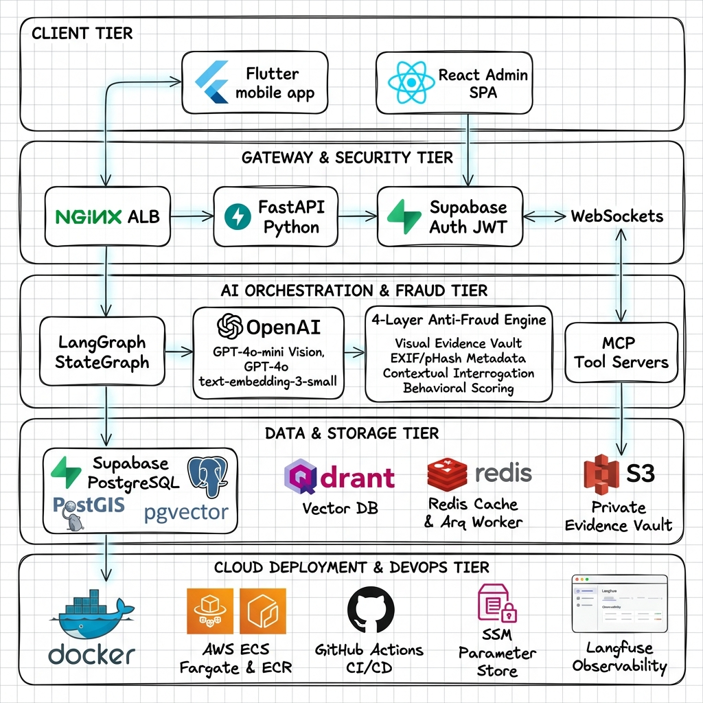
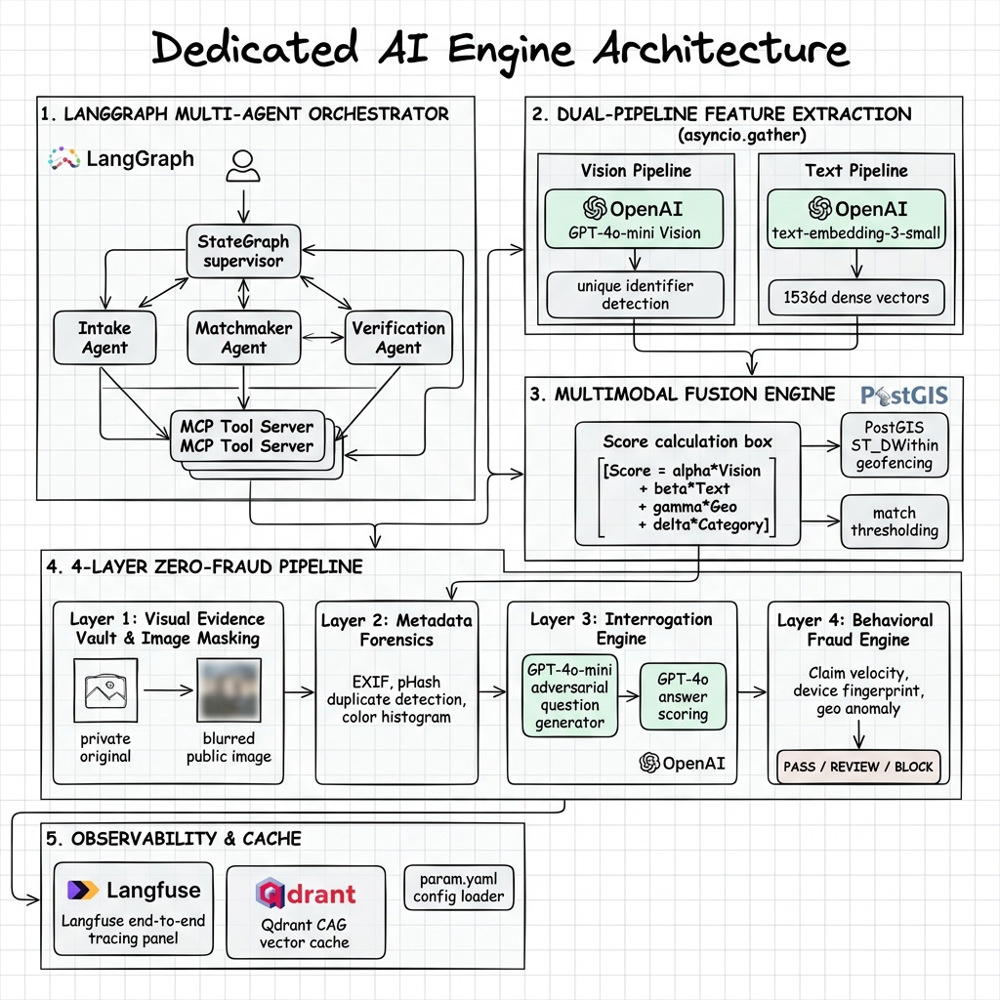
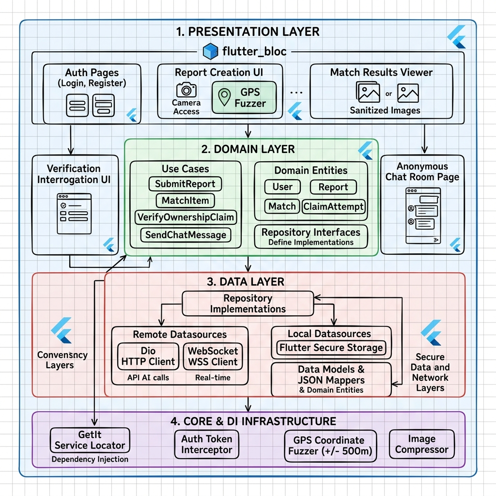
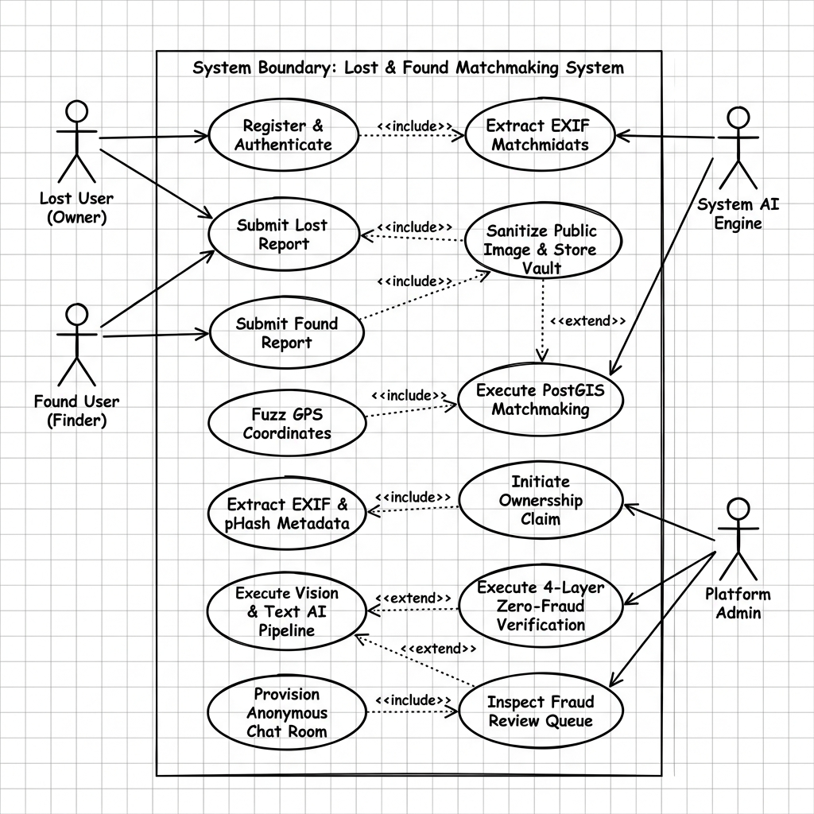
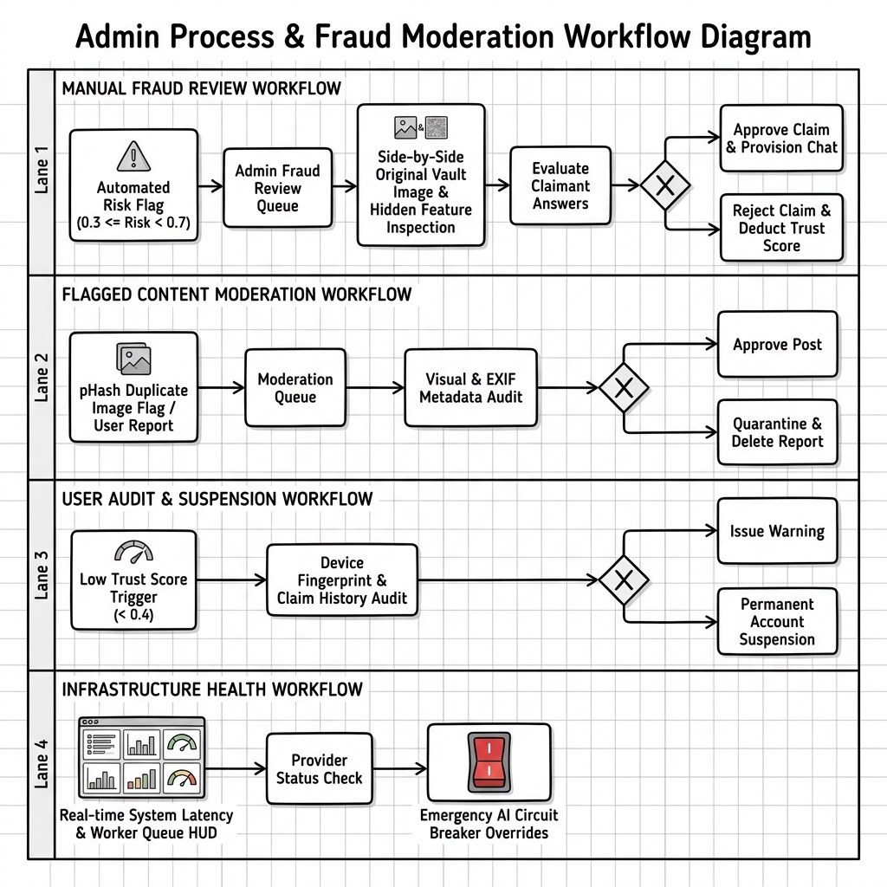

<div align="center">

# 🔍 VERIFIND AI
### Visual Evidence Vault & Resilient Multi-Agentic Lost and Found Matchmaking System

[](LICENSE)
[](https://www.python.org/)
[](https://fastapi.tiangolo.com/)
[](https://openai.com/)
[](https://www.langchain.com/langgraph)
[](https://postgis.net/)
[](https://flutter.dev/)

<p align="center">
  <b>Zero-Fraud Architecture</b> · <b>Multi-Agentic LangGraph Orchestration</b> · <b>PostGIS Spatial Geofencing</b> · <b>Dual Multimodal Pipelines</b>
</p>

</div>

---

## 📌 Executive Overview

**VERIFIND AI** is a state-of-the-art, production-grade lost and found intelligence platform designed to eliminate false ownership claims through a novel **4-Layer Zero-Fraud Verification Shield** and an autonomous **Multi-Agentic StateGraph Engine**.

Unlike conventional lost and found bulletin boards that expose raw photos and un-blurred item descriptions, **VERIFIND AI** automatically sanitizes public images (masking unique stickers, scratches, and serial numbers), securely archives original photos in an encrypted **Visual Evidence Vault**, and challenges potential claimants with dynamic **Adversarial Interrogation Questions** generated by AI.

---

## 🔥 Key Innovation Features

### 🛡️ 1. 4-Layer Zero-Fraud Verification Shield
* **Layer 1: Visual Evidence Vault & Image Sanitization**  
  AI (`gpt-4o-mini`) detects unique visual identifiers (stickers, scratches, engravings, custom keychains), generates bounding box mask coordinates, applies Pillow Gaussian blur ($\sigma=15$) for public display, and safely archives un-blurred originals in an encrypted private vault.
* **Layer 2: Forensic Metadata Fingerprinting**  
  Server-side extraction of camera EXIF metadata, 64-bit perceptual hashing (pHash) for near-duplicate image re-upload blocking, and 3D HSV color histogram distribution signatures.
* **Layer 3: Contextual Interrogation Engine**  
  `gpt-4o-mini` dynamically generates adversarial questions regarding hidden features claimants cannot see. Claimant responses are semantically evaluated by `gpt-4o` for specificity and consistency.
* **Layer 4: Behavioral Fraud Scoring**  
  Continuous tracking of claim velocity ($\le 3$ claims/24h), failed verification cooldowns (3 failures $\rightarrow$ 24-hour lockout), hardware device fingerprints, and geo-anomaly flags.

### 🤖 2. Multi-Agentic LangGraph Orchestration & MCP Protocol
* Powered by a **LangGraph StateGraph Multi-Agent Engine**:
  - **Supervisor / Router Agent**: Payload classification and intent routing.
  - **Report Intake Agent**: Multi-label taxonomy categorization and mask region coordinate extraction.
  - **Matchmaker Agent**: PostGIS spatial queries, vector similarity search, and score fusion computation.
  - **Interrogation Agent**: Dynamic question generation and semantic answer scoring.
* Decoupled tool execution boundaries via standardized **Model Context Protocol (MCP)** stdio servers (`Vision`, `Report`, `GeoSpatial`, `Fraud`, `Chat`).

### ⚡ 3. Dual-Pipeline Multimodal Feature Engine (`asyncio.gather`)
* Concurrent execution of **Vision Feature Parsing** (`gpt-4o-mini`) and **Dense Vector Embedding Generation** (`text-embedding-3-small` 1536-dimensional vectors indexed via PostgreSQL `pgvector`).
* **Multimodal Score Fusion Formula**:
  $$\text{Score} = \alpha \cdot S_{\text{vision}} + \beta \cdot S_{\text{text}} + \gamma \cdot S_{\text{geo}} + \delta \cdot S_{\text{category}}$$

### 🔄 4. Resilient Multi-Provider Circuit Breakers
* Zero-downtime automated fallback routing:
  - **Vision**: OpenAI `gpt-4o-mini` $\rightarrow$ Google Gemini 2.5 Flash $\rightarrow$ Local OpenCV + PyTesseract.
  - **Reasoning**: OpenAI `gpt-4o` $\rightarrow$ Anthropic Claude 3.5 Sonnet $\rightarrow$ Local Fuzzy Levenshtein Engine.
  - **Embeddings**: OpenAI `text-embedding-3-small` $\rightarrow$ Local Ollama `nomic-embed-text` / HuggingFace `all-MiniLM-L6-v2`.

---

## 🏗️ System Architecture & Diagram Suite

### 1. Full Expanded System & Cloud Deployment Architecture


### 2. Dedicated AI Engine Architecture


### 3. Flutter Mobile App Clean Architecture


### 4. System Use Case Diagram


### 5. Admin Workflow & Fraud Moderation Process


---

## 🛠️ Technology Stack

| Layer | Technology | Purpose |
|---|---|---|
| **Mobile Client** | Flutter 3.x (BLoC + Dio + GetIt) | Cross-platform mobile app with GPS coordinate fuzzing ($\pm 500\text{m}$) |
| **Backend Gateway** | Python 3.11 + FastAPI | Core RESTful API & WebSocket engine |
| **Agent Framework** | LangGraph (StateGraph) | Multi-agent orchestration state machine |
| **Tool Boundary** | Model Context Protocol (MCP) | Decoupled stdio tool servers |
| **Primary AI Models** | OpenAI `gpt-4o-mini`, `gpt-4o`, `text-embedding-3-small` | Multimodal parsing, vector embeddings & interrogation scoring |
| **Spatial Database** | PostgreSQL 16 + PostGIS extension | High-speed spatial indexing (`ST_DWithin`) |
| **Vector Search** | PostgreSQL `pgvector` extension | 1536-dimensional $k$-NN vector similarity search |
| **Cache & Worker Queue** | Redis + Arq | High-speed in-memory cache & async background task worker |
| **Media Storage** | Supabase Storage | `public-sanitized` and encrypted `private-vault` S3 buckets |
| **Observability** | Langfuse | Full-stack LLM tracing & prompt management |

---

## 🚀 Quick Start Guide

**Local / demo-prod full runbook:** [`docs/PRODUCTION_EXECUTION.md`](docs/PRODUCTION_EXECUTION.md)  
**Secrets:** [`docs/ENV_SETUP.md`](docs/ENV_SETUP.md)

### Prerequisites
- **Python 3.11+** (via [uv](https://docs.astral.sh/uv/))
- **Docker & Docker Compose**
- **Flutter SDK 3.x** (mobile)
- **OpenAI API Key** + Supabase project

### 1. Clone & Set Environment Variables
```bash
git clone https://github.com/your-username/verifind-ai.git
cd verifind-ai

make env
# Fill SUPABASE_* / OPENAI_* — then harden for prod: AUTH_DEV_BYPASS=false, API_RELOAD=false
make install
make test-db && make init-schema && make ensure-buckets
```

### 2. Launch Local Services via Docker Compose
```bash
make up
```

### 3. Verify System Health Endpoint
```bash
make health
# or: curl http://localhost:8000/health
```

### 4. Run Flutter Mobile App
```bash
make mobile-get && make mobile-run
```

---

## 📄 License & Copyright

Copyright (c) 2026 **Dilaksha Haritha Dissanayake** (<dilakshadissanayake01@gmail.com>).

This project is licensed under the **PolyForm Noncommercial License 1.0.0 & CC BY-NC 4.0** (Non-Commercial Use Only).

* **Academic, Research & Personal Use**: Explicitly permitted.
* **Commercial Use, Resale, SaaS Hosting & Business Exploitation**: Strictly prohibited without a prior written commercial license from the author.

For commercial licensing inquiries, please contact: **Dilaksha Haritha Dissanayake** (<dilakshadissanayake01@gmail.com>).
