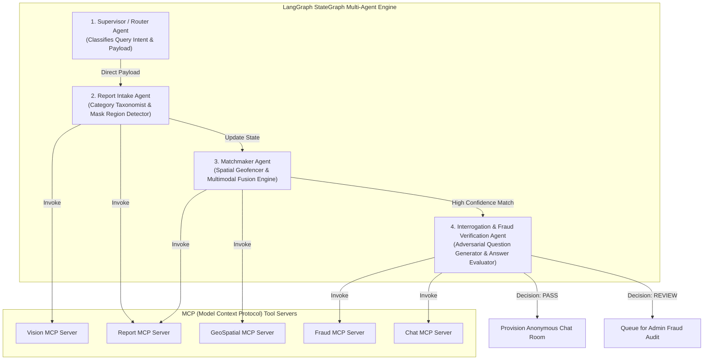
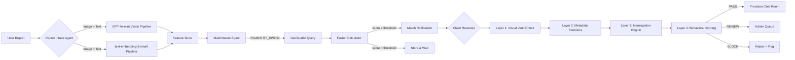
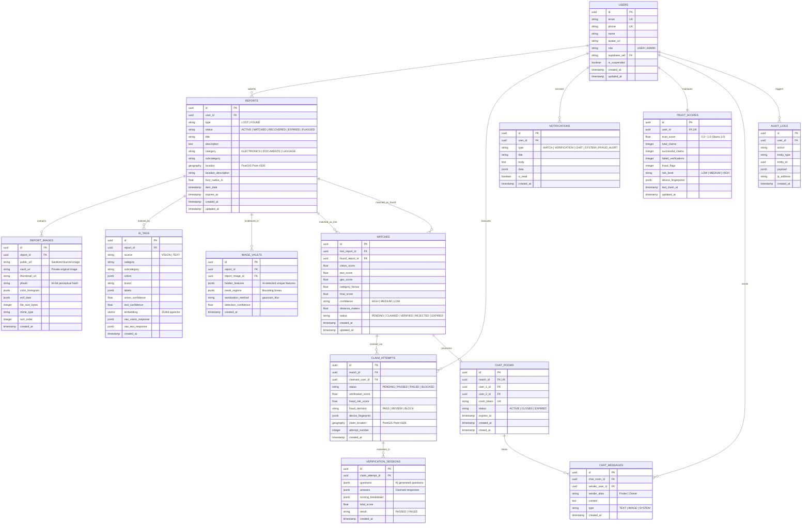
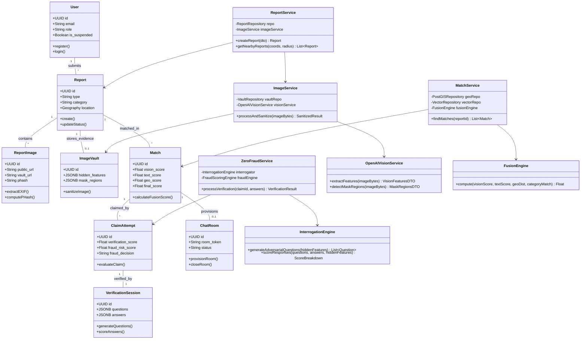
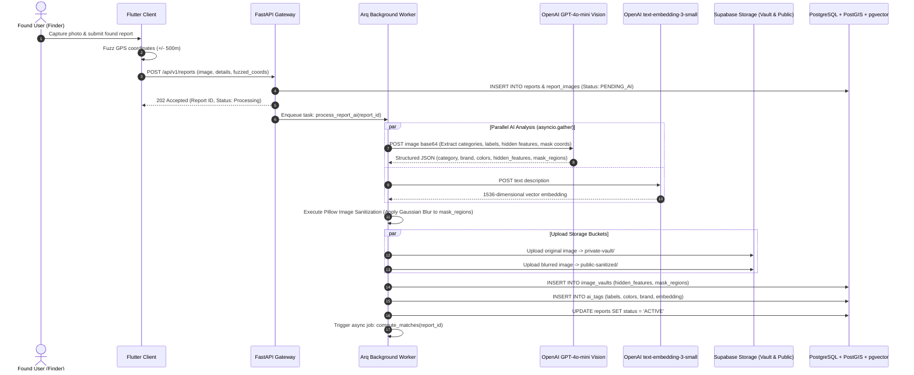
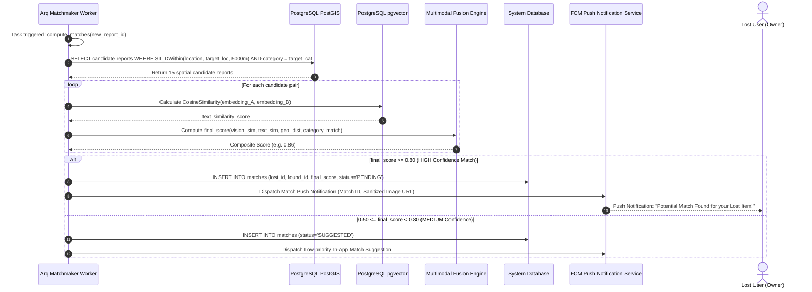
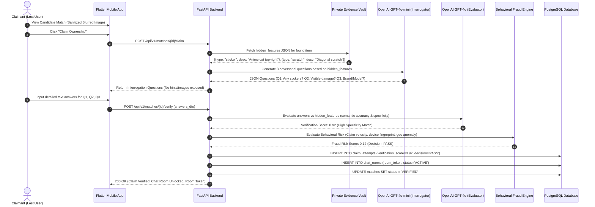

---

## 1. Executive Summary & Complete System Overview (A to Z Operational Workflow)

### 1.1 Academic Motivation & Problem Context
Loss of personal belongings (wallets, smartphones, passports, keys, laptops) causes severe emotional distress, financial loss, and productivity disruption worldwide. Conventional lost and found systems rely on passive bulletin boards or simplistic social media postings. These systems suffer from four fundamental flaws:
1. **High Vulnerability to Fraud & Extortion**: Fraudulent actors claim high-value items by visually inspecting un-blurred public photos and guessing simple descriptions.
2. **Lack of Privacy & Location Security**: Exact GPS locations of lost items expose user movement patterns and home/work locations.
3. **Manual & Unscalable Matchmaking**: Human operators cannot scale to perform real-time cross-matching across thousands of spatial and visual features.
4. **Brittle Single-Provider API Dependencies**: System outages occur whenever a single AI provider experiences rate limits or service downtime.

**VERIFIND AI** resolves these limitations by introducing a **Zero-Fraud, Resilient Multi-Agentic Matchmaking Platform** powered by visual evidence vaults, dynamic adversarial interrogation, PostGIS spatial geofencing, and multi-tier model circuit breakers.

---

### 1.2 End-to-End Operational Lifecycle (A to Z Workflow)

```
[A] Auth & Setup ──▶ [B] Report & Fuzz GPS ──▶ [C] Ingest & 202 ──▶ [D] Async Dual-AI (Vision + Vector)
                                                                            │
[H] Push Alert ◄── [G] Multimodal Fusion ◄── [F] Metadata Forensics ◄── [E] Pillow Masking & Vault Upload
       │
       ▼
[I] Claim Trigger ──▶ [J] Interrogation Qs ──▶ [K] Semantic Scoring ──▶ [L] Behavioral Fraud Risk Check
                                                                                  │
[O] Recovery ◄── [N] Anonymous WSS Chat ◄── [M] Decision: PASS (Score > 0.8) ◄───┴──▶ Decision: REVIEW (Admin Queue)
```

- **A: Authentication & Identity Management**: User registers/logs in via Supabase Auth (JWT with 15-minute TTL & refresh token auto-rotation).
- **B: Report Submission & Coordinate Fuzzing**: User captures an item photo and description on Flutter mobile app. GPS coordinates are automatically randomized within a $\pm 500\text{m}$ radius client-side before transmission.
- **C: Ingestion Gateway & Async Offloading**: FastAPI receives payload, writes initial database records, and immediately returns **HTTP 202 Accepted** (latency $\le 200\text{ms}$). The heavy AI pipeline is enqueued to Arq + Redis background workers.
- **D: Dual-Pipeline Concurrent AI Analysis**: Background worker executes `asyncio.gather` for parallel feature processing:
  - *Vision Pipeline (`gpt-4o-mini`)*: Multimodal extraction of categories, dominant colors, brand logos, OCR text, and normalized bounding box mask coordinates `[x_min, y_min, x_max, y_max]` for unique identifiers (stickers, scratches, serial #s).
  - *Text Pipeline (`text-embedding-3-small`)*: Generates a 1536-dimensional L2-normalized dense vector embedding.
- **E: Image Sanitization & Evidence Vault Storage**: Pillow (PIL) crops bounding boxes, applies Gaussian Blur ($\sigma=15$), and uploads the sanitized image to the `public-sanitized` Supabase storage bucket. The un-blurred original image is stored securely in the `private-vault` bucket alongside a structured JSON array of hidden features.
- **F: Forensic Metadata Fingerprinting**: Worker extracts camera EXIF metadata, computes a 64-bit perceptual hash (pHash) to catch re-uploaded public images, and generates 3D HSV color histogram signatures.
- **G: PostGIS Spatial Geofencing**: Background worker invokes PostGIS `ST_DWithin` spatial query using GIST indexes to fetch candidate matches within search radius $R_{\text{max}} = 5.0\text{km}$.
- **H: Multimodal Score Fusion**: Computes composite match score: $\text{Score} = \alpha \cdot \text{Vision} + \beta \cdot \text{Text} + \gamma \cdot \text{Geo} + \delta \cdot \text{Category}$.
- **I: Push & In-App Match Notification**: High confidence matches ($\text{Score} \ge 0.80$) trigger FCM push alerts to both parties with the sanitized public image.
- **J: Ownership Claim Initiation**: Potential owner views candidate match (sanitized image) and clicks "Claim Ownership".
- **K: Vault Feature Retrieval**: Server retrieves hidden feature JSON from `private-vault` bucket without exposing it to the client.
- **L: Contextual Interrogation Question Generation**: `gpt-4o-mini` dynamically generates 3 adversarial questions targeting hidden features claimant cannot see (e.g. "Describe any stickers on the top cover").
- **M: Semantic Answer Evaluation & Scoring**: `gpt-4o` evaluates claimant text responses against hidden feature JSON, computing a semantic specificity score.
- **N: Behavioral Fraud Scoring & Actioning**: Fraud engine checks claim velocity ($\le 3$/24h), failed claim cooldowns, device fingerprints, and geo-anomalies:
  - $\text{Risk} < 0.3 \rightarrow$ **PASS**: Automatically provisions an anonymous WebSocket chat room.
  - $0.3 \le \text{Risk} < 0.7 \rightarrow$ **REVIEW**: Routes claim to Admin Fraud Queue for side-by-side vault inspection.
  - $\text{Risk} \ge 0.7 \rightarrow$ **BLOCK**: Rejects claim, flags account, and deducts user trust score.
- **O: Anonymous Chat Communication**: Unlocked room allows real-time messaging over WSS with Redis Pub/Sub relay and `Finder` vs `Owner` alias masking.
- **P: Recovery & Archival**: Users mark report as `RECOVERED` or `RETURNED`, closing the chat room and archiving the report.
- **Q: Admin Moderation & Infrastructure Monitoring**: React SPA dashboard allows administrators to review flagged claims, suspend fraudsters, inspect system health HUDs, and trigger circuit breaker overrides.
- **R: Multi-Provider Resiliency & Circuit Breakers**: Primary OpenAI API calls automatically failover to Google Gemini 2.5 Flash, Anthropic Claude 3.5 Sonnet, or local Ollama/OpenCV engines during external outages.
- **S: Full Observability & Audit Tracing**: 100% of LLM calls, tool executions, and pipeline steps are logged to Loguru JSON structured logs and traced via Langfuse.

---

## 2. Project Scope & Multi-Agentic Execution Boundary

### 1.1 In-Scope Capabilities
- **Multi-Agentic System Orchestration**: Autonomous agent workflow running on a LangGraph StateGraph state machine with decoupled MCP tool boundaries.
- **Dual-Pipeline Multimodal Feature Processing**: Concurrent execution (`asyncio.gather`) of image feature extraction (`gpt-4o-mini`) and 1536d text vector embedding (`text-embedding-3-small`).
- **4-Layer Zero-Fraud Verification Shield**: Visual Evidence Vault, automated PIL image sanitization (bounding box Gaussian blur), metadata forensics (EXIF + pHash duplicate detection + HSV color histograms), adversarial interrogation question generation (`gpt-4o-mini`), semantic response evaluation (`gpt-4o`), and behavioral fraud risk scoring.
- **Spatial Geofencing & Matchmaking Engine**: PostGIS `ST_DWithin` spatial query execution ($R_{\text{max}}=5.0\text{km}$) combined with multimodal score fusion ($\alpha \cdot \text{Vision} + \beta \cdot \text{Text} + \gamma \cdot \text{Geo} + \delta \cdot \text{Category}$).
- **Privacy & Anonymous Chat Engine**: Client-side GPS fuzzing ($\pm 500\text{m}$) and anonymous WebSocket chat room provisioning (`Finder` vs `Owner` alias masking).
- **Multi-Tier Resiliency & Model Circuit Breakers**: Primary OpenAI models with automated fallback routing to Google Gemini 2.5 Flash, Anthropic Claude 3.5 Sonnet, and local Ollama/OpenCV engines.
- **Cross-Platform Interfaces & DevOps**: Flutter mobile application (iOS/Android), React SPA Admin Dashboard, Docker containerization, and AWS ECS Fargate deployment via GitHub Actions OIDC CI/CD.

### 1.2 Multi-Agent Orchestration Workflow
The core intelligence layer operates as a **LangGraph StateGraph Multi-Agent Orchestrator** where specialized autonomous agents collaborate via a shared state object (`ReportState` TypedDict):



---

## 2. System Architecture

### 2.1 High-Level Overview


```
┌─────────────────────────────────────────────────────────────────────────────┐
│                              CLIENTS                                         │
│   Flutter Mobile (iOS + Android)  │  Admin Dashboard (React SPA)             │
└──────────────┬────────────────────┴──────────┬───────────────────────────────┘
               │ HTTPS / WSS                   │
               ▼                               ▼
┌──────────────────────────────────────────────────────────────────────────────┐
│                        GATEWAY LAYER                                          │
│  ┌──────────────┐  ┌──────────────────┐  ┌────────────────────────────────┐ │
│  │ Nginx / ALB  │  │ FastAPI App      │  │ WebSocket Server               │ │
│  │ (Reverse     │  │ (REST + SSE +    │  │ (Anonymous chat rooms,         │ │
│  │  Proxy + LB) │  │  Background Jobs)│  │  real-time match alerts)       │ │
│  └──────────────┘  └───────┬──────────┘  └───────────────┬────────────────┘ │
└────────────────────────────┼─────────────────────────────┼──────────────────┘
                             │                             │
                             ▼                             ▼
┌──────────────────────────────────────────────────────────────────────────────┐
│                  ORCHESTRATION LAYER (LangGraph StateGraph)                    │
│                                                                               │
│   ┌────────────────┐    ┌──────────────┐    ┌──────────────────────────────┐│
│   │ Report Intake  │    │  Matchmaker  │    │  Fraud Verification         ││
│   │ Agent          │    │  Agent       │    │  Agent                      ││
│   │ (classify +    │───▶│ (dual-pipe   │───▶│ (4-layer zero-fraud         ││
│   │  tag + store)  │    │  similarity) │    │  pipeline)                  ││
│   └────────────────┘    └──────────────┘    └──────────────────────────────┘│
│                                                                               │
│   ┌────────────────────────────────────────────────────────────────────────┐ │
│   │                    MCP TOOL SERVERS                                     │ │
│   │  ┌─────────┐  ┌─────────┐  ┌─────────┐  ┌──────────┐  ┌───────────┐│ │
│   │  │ Vision  │  │ Report  │  │ GeoSpatial│ │ Fraud    │  │ Chat      ││ │
│   │  │ Server  │  │ Server  │  │ Server   │  │ Server   │  │ Server    ││ │
│   │  └────┬────┘  └────┬────┘  └────┬─────┘  └────┬─────┘  └─────┬─────┘│ │
│   └───────┼────────────┼────────────┼──────────────┼──────────────┼──────┘ │
└───────────┼────────────┼────────────┼──────────────┼──────────────┼────────┘
            │            │            │              │              │
            ▼            ▼            ▼              ▼              ▼
┌──────────────────────────────────────────────────────────────────────────────┐
│                        DATA / STORAGE LAYER                                   │
│                                                                               │
│   ┌──────────────┐  ┌──────────────┐  ┌──────────────┐  ┌──────────────┐  │
│   │  Supabase    │  │  Qdrant      │  │  Redis       │  │  Supabase    │  │
│   │  PostgreSQL  │  │  Cloud       │  │  (Cache +    │  │  Storage     │  │
│   │  + PostGIS   │  │  (Semantic   │  │   Arq Queue) │  │  (Images)    │  │
│   │  + pgvector  │  │   Vectors)   │  │              │  │              │  │
│   └──────────────┘  └──────────────┘  └──────────────┘  └──────────────┘  │
└──────────────────────────────────────────────────────────────────────────────┘
```

### 1.2 Architectural Pattern Map

This system incorporates standard production patterns from modern agentic architectures:

| Pattern | Architectural Paradigm | How System Uses It |
|---|---|---|
| **LangGraph StateGraph orchestrator** | Multi-agent state machine | Report intake → Matchmaking → Verification agents as graph nodes |
| **MCP Tool Servers (stdio transport)** | Decoupled Tool Boundary Protocol | Vision, Report CRUD, GeoSpatial, Fraud, Chat as independent MCP servers |
| **YAML-driven config (`param.yaml`)** | Externalized parameters | All weights, thresholds, API budgets in `config/param.yaml` |
| **Arq + Redis background workers** | Asynchronous task queue | AI analysis, match computation, notification dispatch run off-request-path |
| **Langfuse observability** | Full-stack AI tracing | Per-request traces across all agent nodes |
| **FastAPI lifespan warmup** | Async singleton warming | Pre-warm LLM pools, Qdrant connections, embedder at boot |
| **Docker multi-service compose** | Containerized microservices | `api` + `worker` + `redis` + `web` services |
| **GitHub Actions OIDC CI/CD** | Cloud-native CI/CD | Push to `dev` → ECR → ECS rolling deploy |
| **Supabase (PostgreSQL + Auth)** | Managed Backend & Spatial DB | Auth, RLS, spatial DB, pgvector embeddings |

---

## 2. The Zero-Fraud Pipeline — Core Innovation

This is the **primary research contribution** of the system. A 4-layer anti-fraud pipeline that makes false ownership claims virtually impossible.

### 2.1 Architecture Overview

```
┌────────────────────────────────────────────────────────────────────────────┐
│                    ZERO-FRAUD VERIFICATION PIPELINE                        │
│                    (LangGraph Sub-Graph)                                    │
│                                                                            │
│  ┌──────────────────────────────────────────────────────────────────────┐  │
│  │  LAYER 1: VISUAL EVIDENCE VAULT                                      │  │
│  │                                                                      │  │
│  │  When a FINDER uploads a photo:                                      │  │
│  │                                                                      │  │
│  │  1. GPT-4o-mini (Multimodal) scans image for UNIQUE IDENTIFIERS:    │  │
│  │     • Stickers, patches, decals, engravings                         │  │
│  │     • Scratches, dents, wear marks, cracks                          │  │
│  │     • Serial number plates, barcodes (if visible)                   │  │
│  │     • Custom cases, covers, keychains attached                      │  │
│  │     • Screen lock wallpaper (if phone/laptop screen is on)          │  │
│  │     • Contents visible (e.g. cards in wallet, items in bag)         │  │
│  │                                                                      │  │
│  │  2. ORIGINAL IMAGE stored in secure vault (never shown to claimant) │  │
│  │                                                                      │  │
│  │  3. AI generates SANITIZED PUBLIC IMAGE:                            │  │
│  │     • Unique identifiers are blurred/masked                         │  │
│  │     • Only general shape, category, and dominant color visible      │  │
│  │     • This is what potential claimants see                           │  │
│  │                                                                      │  │
│  │  4. HIDDEN FEATURES LIST stored as structured JSON:                 │  │
│  │     [{"type": "sticker", "description": "Anime cat sticker on       │  │
│  │       back cover", "location": "top-right", "confidence": 0.94},    │  │
│  │      {"type": "scratch", "description": "diagonal scratch on        │  │
│  │       bottom-left corner", "location": "bottom-left", ...}]         │  │
│  └──────────────────────────────────────────────────────────────────────┘  │
│                                    │                                       │
│                                    ▼                                       │
│  ┌──────────────────────────────────────────────────────────────────────┐  │
│  │  LAYER 2: METADATA FINGERPRINTING                                    │  │
│  │                                                                      │  │
│  │  Server-side forensic evidence chain (invisible to users):          │  │
│  │                                                                      │  │
│  │  • EXIF Extraction: Camera model, GPS (if present), timestamp,      │  │
│  │    focal length, ISO — proves provenance of the photo               │  │
│  │                                                                      │  │
│  │  • Perceptual Hash (pHash): Near-duplicate detection across all     │  │
│  │    uploaded images. Catches someone re-uploading the public          │  │
│  │    sanitized image as "proof" they own it                           │  │
│  │                                                                      │  │
│  │  • Color Histogram Fingerprint: Unique distribution signature       │  │
│  │    used for visual similarity matching                               │  │
│  │                                                                      │  │
│  │  • Reverse Image Check: Flag if the image has been seen before      │  │
│  │    in a different report (cross-report duplicate detection)         │  │
│  └──────────────────────────────────────────────────────────────────────┘  │
│                                    │                                       │
│                                    ▼                                       │
│  ┌──────────────────────────────────────────────────────────────────────┐  │
│  │  LAYER 3: CONTEXTUAL INTERROGATION ENGINE                            │  │
│  │                                                                      │  │
│  │  When a LOSER claims a match:                                       │  │
│  │                                                                      │  │
│  │  GPT-4o-mini generates ADVERSARIAL QUESTIONS based on Layer 1 data: │  │
│  │                                                                      │  │
│  │  Example (found item: laptop with anime sticker on back):           │  │
│  │  ┌────────────────────────────────────────────────────────────────┐ │  │
│  │  │  Q1: "Are there any stickers or decorations on this laptop?    │ │  │
│  │  │       If yes, describe what they look like and where they      │ │  │
│  │  │       are placed."                                              │ │  │
│  │  │                                                                 │ │  │
│  │  │  Q2: "Does the laptop have any visible damage or wear marks?   │ │  │
│  │  │       Describe their location and appearance."                  │ │  │
│  │  │                                                                 │ │  │
│  │  │  Q3: "What brand and model is this laptop? What is the         │ │  │
│  │  │       approximate screen size?"                                 │ │  │
│  │  │                                                                 │ │  │
│  │  │  Q4: "What items were in the laptop bag when you lost it?"     │ │  │
│  │  │       (if bag was included in found report)                     │ │  │
│  │  └────────────────────────────────────────────────────────────────┘ │  │
│  │                                                                      │  │
│  │  GPT-4o scores each answer against hidden features (0.0 – 1.0):    │  │
│  │  • Semantic match against stored hidden feature descriptions        │  │
│  │  • Specificity bonus (vague answers score lower)                    │  │
│  │  • Consistency check across multiple answers                        │  │
│  │                                                                      │  │
│  │  verification_score = weighted_avg(q1_score, q2_score, ..., qN_score)│ │
│  └──────────────────────────────────────────────────────────────────────┘  │
│                                    │                                       │
│                                    ▼                                       │
│  ┌──────────────────────────────────────────────────────────────────────┐  │
│  │  LAYER 4: BEHAVIORAL FRAUD SCORING                                   │  │
│  │                                                                      │  │
│  │  Platform-wide fraud detection (runs continuously):                 │  │
│  │                                                                      │  │
│  │  • Claim Velocity: User claiming 5+ items in 24h → flag            │  │
│  │  • Failed Verification Rate: 3+ failed verifications → suspend     │  │
│  │  • Device Fingerprint: Same device claiming under multiple          │  │
│  │    accounts → flag                                                  │  │
│  │  • Geo Anomaly: Claiming items 500km apart within 1 hour → flag    │  │
│  │  • Report Pattern: Always claiming high-value electronics → flag    │  │
│  │                                                                      │  │
│  │  fraud_risk = f(velocity, fail_rate, device, geo, pattern)          │  │
│  │                                                                      │  │
│  │  Actions:                                                            │  │
│  │  • risk < 0.3  → PASS (proceed to chat room)                       │  │
│  │  • 0.3 ≤ risk < 0.7 → REVIEW (admin must approve)                  │  │
│  │  • risk ≥ 0.7  → BLOCK (reject claim, notify admin)                │  │
│  └──────────────────────────────────────────────────────────────────────┘  │
└────────────────────────────────────────────────────────────────────────────┘
```

### 2.2 Image Sanitization Flow

```
FINDER uploads photo
        │
        ▼
┌───────────────────────────────────┐
│ OpenAI GPT-4o-mini (Multimodal)   │
│ ───────────────────────────────── │
│ • Object & brand detection        │
│ • Category classification         │
│ • Unique Identifier Extraction:   │
│   "Analyze this image of a found  │
│   item. List ALL unique           │
│   identifying features that could │
│   prove ownership: stickers,      │
│   scratches, serial numbers,      │
│   custom modifications..."        │
│                                   │
│ Output (Structured JSON):         │
│ {                                 │
│   "hidden_features": [...],       │
│   "mask_regions": [               │
│     {"x": 120, "y": 45,           │
│      "w": 80, "h": 60}            │
│   ],                              │
│   "category": "laptop",           │
│   "public_description": "Silver   │
│    laptop, approximately 15 inch" │
│ }                                 │
└────────┬──────────────────────────┘
         │
    ┌────┴────┐
    │         │
    ▼         ▼
┌────────┐  ┌──────────────────┐
│ VAULT  │  │ SANITIZED IMAGE  │
│ (S3    │  │ (blurred unique  │
│ private│  │  features, shown │
│ bucket)│  │  to claimants)   │
└────────┘  └──────────────────┘
```

---

## 3. AI Layer — Dual-Pipeline Similarity Engine & Resilient Architecture

### 3.1 Multimodal Matching Pipeline (Native OpenAI)


```
┌────────────────────────────────────────────────────────────────────────────┐
│                   DUAL-PIPELINE SIMILARITY ENGINE                          │
│                   (asyncio.gather — concurrent execution)                   │
│                                                                            │
│  Incoming: {image: bytes, text: str, coords: {lat, lng}, type: LOST|FOUND}│
│                                                                            │
│  ┌──────────────────────────────┐  ┌──────────────────────────────────┐   │
│  │  PIPELINE 1: VISION          │  │  PIPELINE 2: TEXT                │   │
│  │                              │  │                                   │   │
│  │  OpenAI GPT-4o-mini Vision   │  │  OpenAI text-embedding-3-small   │   │
│  │  ─────────────────────────   │  │  + GPT-4o-mini Semantic Parse   │   │
│  │  • Multimodal feature parse  │  │  ──────────────────────────────   │   │
│  │  • Brand / Model detection   │  │  • Entity extraction             │   │
│  │  • Color & Material extract  │  │  • Category inference            │   │
│  │  • Unique identifier extract │  │  • 1536d Dense Vector Embedding  │   │
│  │                              │  │                                   │   │
│  │  Output:                     │  │  Output:                          │   │
│  │  • category: "electronics"  │  │  • text_embedding: vec[1536]     │   │
│  │  • subcategory: "laptop"    │  │  • extracted_attrs: {color,      │   │
│  │  • colors: ["silver","black"]│ │  │   brand, condition, etc.}      │   │
│  │  • brand: "Apple"           │  │  • category_guess: "laptop"      │   │
│  │  • labels: ["macbook",      │  │  • confidence: 0.92              │   │
│  │    "computer", "keyboard"]  │  │                                   │   │
│  │  • confidence: 0.95         │  │                                   │   │
│  └──────────────┬───────────────┘  └──────────────────┬────────────────┘   │
│                 │                                      │                    │
│                 ▼                                      ▼                    │
│  ┌──────────────────────────────────────────────────────────────────────┐  │
│  │                    MULTIMODAL FUSION ENGINE                           │  │
│  │                                                                      │  │
│  │  For each candidate pair (lost_report ↔ found_report):              │  │
│  │                                                                      │  │
│  │  vision_score  = cosine_sim(vision_labels_A, vision_labels_B)       │  │
│  │  text_score    = cosine_sim(text_embedding_A, text_embedding_B)     │  │
│  │  geo_score     = 1 - min(distance_km / max_radius_km, 1.0)         │  │
│  │  category_bonus = 1.0 if category_A == category_B else 0.0         │  │
│  │                                                                      │  │
│  │  ┌───────────────────────────────────────────────────────────────┐  │  │
│  │  │  final_score = (α × vision_score)                             │  │  │
│  │  │              + (β × text_score)                                │  │  │
│  │  │              + (γ × geo_score)                                 │  │  │
│  │  │              + (δ × category_bonus)                            │  │  │
│  │  │                                                                │  │  │
│  │  │  Default weights (configurable in param.yaml):                 │  │  │
│  │  │  α = 0.30, β = 0.30, γ = 0.25, δ = 0.15                     │  │  │
│  │  └───────────────────────────────────────────────────────────────┘  │  │
│  │                                                                      │  │
│  │  Thresholds:                                                         │  │
│  │  • HIGH:   score ≥ 0.80 → Auto-notify both parties                 │  │
│  │  • MEDIUM: 0.50 ≤ score < 0.80 → Suggest match, notify loser       │  │
│  │  • LOW:    score < 0.50 → Store, no notification                    │  │
│  └──────────────────────────────────────────────────────────────────────┘  │
└────────────────────────────────────────────────────────────────────────────┘
```

### 3.2 LangGraph Orchestrator — Agent Topology



### 3.3 Deep-Dive Pipeline Mechanics

#### 3.3.1 Vision Feature Extraction & Bounding Box Masking Pipeline
- **Input**: Base64 encoded image string or binary stream.
- **Multimodal Visual Extraction**: Executed via OpenAI `gpt-4o-mini` with forced JSON Schema validation (`response_format={"type": "json_object"}`). Extracts:
  1. `category` & `subcategory`: Normalized against pre-defined taxonomy.
  2. `colors`: Dominant primary and secondary color palette.
  3. `brand_markings`: Optical character recognition (OCR) and logo detection for brands (e.g., Apple, Dell, Nike, Samsonite).
  4. `unique_identifiers`: Array of distinct visual features (stickers, scratches, engravings, keychains, damage).
  5. `mask_regions`: Normalized bounding box coordinates `[x_min, y_min, x_max, y_max]` (scale 0-1000) for every detected unique identifier.
- **Image Sanitization Engine**: Pillow (PIL) crops bounding box regions, applies a Gaussian Blur filter ($\sigma=15$) or pixelation block ($16 \times 16$), and saves the sanitized image to the public Supabase Storage bucket (`public-sanitized`). The original un-blurred image is saved directly to the encrypted `private-vault` bucket.

#### 3.3.2 Text & Semantic Vector Embedding Pipeline
- **Semantic Text Parsing**: Parses unstructured user descriptions using `gpt-4o-mini` to extract structured JSON metadata (condition, material, serial numbers if provided, lost time window).
- **Dense Vector Embedding**: Generates a 1536-dimensional vector embedding using `text-embedding-3-small`.
- **Normalization & Vector Storage**: L2-normalized vector is written to PostgreSQL (`ai_tags.embedding` column with PostGIS pgvector extension) and indexed using an `IVFFlat` index (`lists = 100`) for sub-10ms $k$-NN cosine similarity lookups.

#### 3.3.3 Multimodal Score Fusion Mathematics
The similarity between a Lost Report ($L$) and a Found Report ($F$) is evaluated across four orthogonal feature spaces:
$$\text{Score}(L, F) = \alpha \cdot S_{\text{vision}}(L, F) + \beta \cdot S_{\text{text}}(L, F) + \gamma \cdot S_{\text{geo}}(L, F) + \delta \cdot S_{\text{category}}(L, F)$$

Where:
- $S_{\text{vision}}(L, F) = \text{CosineSimilarity}(\mathbf{V}_L, \mathbf{V}_F)$: Jaccard/Cosine similarity across extracted vision label sets.
- $S_{\text{text}}(L, F) = \frac{\mathbf{E}_L \cdot \mathbf{E}_F}{\|\mathbf{E}_L\| \|\mathbf{E}_F\|}$: Cosine similarity between 1536d text embeddings.
- $S_{\text{geo}}(L, F) = 1 - \min\left(\frac{\text{ST\_Distance}(L.\text{loc}, F.\text{loc})}{R_{\text{max}}}, 1.0\right)$: Linear decay penalty up to maximum search radius $R_{\text{max}} = 5.0\text{ km}$.
- $S_{\text{category}}(L, F) = \begin{cases} 1.0 & \text{if } L.\text{category} = F.\text{category} \\ 0.0 & \text{otherwise} \end{cases}$: Hard category gating factor.
- Default weights ($\alpha=0.30, \beta=0.30, \gamma=0.25, \delta=0.15$) configured dynamically in `config/param.yaml`.

---

### 3.4 Model Tiering, Multi-Provider Fallbacks & System Resiliency

To ensure zero downtime, cost efficiency, and graceful operational continuity, the system implements a strict **Resilient Model Tiering & Circuit Breaker Architecture**:

```
Primary Provider (OpenAI) ──────[Rate Limit / 5xx Error]─────▶ Secondary Provider (Gemini / Claude)
                                                                          │
                                                                   [API Outage / Offline]
                                                                          ▼
                                                                 Local Self-Hosted Fallback
                                                                 (Ollama / SentenceTransformers)
```

#### 3.4.1 LLM & Vision Provider Fallback Matrix

| Pipeline Component | Primary Provider & Model | Secondary Provider Fallback | Local / Offline Fallback |
|---|---|---|---|
| **Vision & Image Parsing** | **OpenAI `gpt-4o-mini`** (Multimodal) | **Google Gemini 2.5 Flash** (via Direct Google API) | OpenCV + PyTesseract (Color Histograms + Local OCR) |
| **High-Reasoning Verification** | **OpenAI `gpt-4o`** | **Anthropic Claude 3.5 Sonnet** | Deterministic Rule Engine (Levenshtein Distance & TF-IDF) |
| **Text Vector Embeddings** | **OpenAI `text-embedding-3-small`** (1536d) | **Google `text-embedding-004`** (projected to 1536d) | Ollama Local `nomic-embed-text` or HuggingFace `all-MiniLM-L6-v2` |

#### 3.4.2 System Infrastructure Fallback Declarations

```
┌───────────────────────────┬───────────────────────────┬───────────────────────────┐
│ System Service            │ Primary Component         │ Fallback Mechanism        │
├───────────────────────────┼───────────────────────────┼───────────────────────────┤
│ Vector Search             │ Qdrant Cloud Collection   │ PostgreSQL `pgvector`     │
│ Spatial Proximity         │ PostGIS `ST_DWithin`      │ Python Haversine Formula  │
│ Private Evidence Vault    │ Supabase S3 Bucket        │ Local Encrypted File System│
│ Cache & Queue             │ Redis + Arq               │ Synchronous Background    │
│                           │                           │ Task Queue (FastAPI)      │
└───────────────────────────┴───────────────────────────┴───────────────────────────┘
```

1. **Embedding Model Fallback**: If OpenAI embedding API fails, the backend switches to Ollama local `nomic-embed-text` or HuggingFace `all-MiniLM-L6-v2`. A linear projection layer normalizes local vectors to match pgvector 1536d space.
2. **Vision Model Fallback**: If `gpt-4o-mini` vision encounters rate limits (HTTP 429), `AiGatewayService` reroutes the payload to `gemini-2.5-flash`. If both external APIs are unreachable, local OpenCV extracts color histograms and PyTesseract extracts visible text to ensure report intake never fails.
3. **Verification Reasoning Fallback**: If `gpt-4o` is unavailable during claimant interrogation scoring, the verification node falls back to Anthropic `claude-3-5-sonnet`. If network access is completely severed, a local deterministic string-matching algorithm (fuzzy Levenshtein distance on hidden features) evaluates claimant answers.
4. **Vector DB Fallback**: If Qdrant Cloud returns a connection error, search automatically degrades to PostgreSQL `pgvector` cosine similarity (`<=>` operator).
5. **Spatial Query Fallback**: If PostGIS extensions fail, spatial filtering falls back to standard bounding box SQL queries combined with Python Haversine distance calculation.

---

## 4. Complete System Diagrams Suite (UML & Data Models)

### 4.0 Flutter Mobile App Clean Architecture Diagram


---

### 4.1 Production Entity Relationship Diagram (ERD)



---

### 4.2 Comprehensive System Use Case Diagram

```mermaid
graph TD
    subgraph Actors["System Actors"]
        U1["Lost User (Owner)"]
        U2["Found User (Finder)"]
        AI["System AI Engine"]
        ADM["Platform Admin"]
    end

    subgraph System_Boundary["System Boundary: Lost and Found Matchmaking System"]
        UC01(["Register & Authenticate"])
        UC02(["Submit Lost Item Report"])
        UC03(["Submit Found Item Report"])
        UC04(["Fuzz GPS Location Coordinates"])
        UC05(["Extract EXIF & Compute pHash Metadata"])
        UC06(["Execute Multimodal Vision & Text Pipeline"])
        UC07(["Sanitize Public Image & Store Evidence Vault"])
        UC08(["Execute PostGIS Geofenced Matchmaking"])
        UC09(["Receive AI Match Push Notification"])
        UC10(["View Candidate Match with Sanitized Image"])
        UC11(["Initiate Ownership Claim"])
        UC12(["Execute 4-Layer Zero-Fraud Verification"])
        UC13(["Answer Contextual Interrogation Questions"])
        UC14(["Score Answers & Calculate Behavioral Fraud Risk"])
        UC15(["Provision Anonymous WebSocket Chat Room"])
        UC16(["Communicate Anonymously in Chat Room"])
        UC17(["Mark Item as Recovered / Returned"])
        UC18(["Inspect Manual Fraud Review Queue"])
        UC19(["Audit User Accounts & Suspend Fraudsters"])
        UC20(["Monitor Infrastructure Health & AI Metrics"])
    end

    U1 --> UC01
    U1 --> UC02
    U1 --> UC09
    U1 --> UC10
    U1 --> UC11
    U1 --> UC13
    U1 --> UC16
    U1 --> UC17

    U2 --> UC01
    U2 --> UC03
    U2 --> UC09
    U2 --> UC16
    U2 --> UC17

    UC02 -. "includes" .-> UC04
    UC03 -. "includes" .-> UC04
    UC03 -. "includes" .-> UC05

    AI --> UC06
    AI --> UC07
    AI --> UC08
    AI --> UC12
    AI --> UC14

    UC06 -. "includes" .-> UC07
    UC08 -. "includes" .-> UC09
    UC11 -. "includes" .-> UC12
    UC12 -. "includes" .-> UC13
    UC12 -. "includes" .-> UC14
    UC14 -. "extends (On Pass)" .-> UC15

    ADM --> UC18
    ADM --> UC19
    ADM --> UC20
```




---

### 4.3 Clean Architecture Class Diagram



---

### 4.4 Sequence Diagrams Suite

#### Sequence Diagram 1: Report Intake, Image Sanitization & Multi-Vector Indexing Flow


#### Sequence Diagram 2: Spatial Geofencing & Multimodal Matchmaking Flow


#### Sequence Diagram 3: 4-Layer Zero-Fraud Interrogation & Verification Flow


#### Sequence Diagram 4: Anonymous WebSocket Chat & Fraud Intervention Flow
```mermaid
sequenceDiagram
    autonumber
    actor UserA as Lost User (Owner)
    actor UserB as Found User (Finder)
    participant AppA as Flutter Client A
    participant AppB as Flutter Client B
    participant WSS as FastAPI WebSocket Server
    participant Redis as Redis Pub/Sub Broker
    participant DB as PostgreSQL Database

    UserA->>AppA: Open Chat Room (Token: room-xyz)
    AppA->>WSS: WSS /ws/chat/room-xyz?token=JWT_A
    WSS->>WSS: Authenticate JWT & Verify UserA is member of room-xyz
    WSS-->>AppA: WebSocket Connection Established (Alias: "Owner")

    UserB->>AppB: Open Chat Room (Token: room-xyz)
    AppB->>WSS: WSS /ws/chat/room-xyz?token=JWT_B
    WSS-->>AppB: WebSocket Connection Established (Alias: "Finder")

    UserA->>AppA: Type message: "Hi, I answered the verification questions. Where can we meet?"
    AppA->>WSS: Send WSS Message Payload {content: "Hi...", room_token: "room-xyz"}
    
    WSS->>DB: INSERT INTO chat_messages (chat_room_id, sender_alias='Owner', content)
    WSS->>Redis: PUBLISH room-xyz {sender: "Owner", content: "Hi..."}
    
    Redis-->>WSS: Relay message to active room subscribers
    WSS-->>AppB: Deliver WSS Frame {sender: "Owner", content: "Hi...", timestamp}

    UserB->>AppB: Type reply: "Great! I am near the Central Station library."
    AppB->>WSS: Send WSS Message Payload
    WSS->>DB: INSERT INTO chat_messages (sender_alias='Finder')
    WSS->>Redis: PUBLISH room-xyz
    Redis-->>WSS: Relay
---

### 4.5 Admin Workflow & Fraud Moderation Process Diagram


```mermaid
graph TD
    subgraph Trigger_Events["System Trigger Events"]
        T1["Automated Claim Risk Flag<br/>(0.3 <= Risk < 0.7)"]
        T2["pHash Duplicate Image Flag<br/>OR User Report"]
        T3["Low User Trust Score<br/>(Trust < 0.4)"]
        T4["System Latency Alert<br/>OR Provider Error"]
    end

    subgraph Admin_Queues["Admin Dashboard Queues (React SPA)"]
        Q1["Manual Fraud Review Queue"]
        Q2["Content Moderation Queue"]
        Q3["User Audit & Suspension Queue"]
        Q4["Infrastructure Health HUD"]
    end

    subgraph Moderation_Actions["Admin Moderation & Audit Actions"]
        A1["Side-by-Side Inspection:<br/>Vault Original Image vs Public Image"]
        A2["Audit Claimant Interrogation Answers<br/>against Hidden Feature Metadata"]
        A3["Inspect EXIF Headers &<br/>pHash Match Reports"]
        A4["Review Device Fingerprints &<br/>Historical Claim Velocity"]
        A5["Monitor AI Provider Status &<br/>API Latency Metrics"]
    end

    subgraph Decision_Gateways["Admin Decision Gateways"]
        D1{"Approve Claim?"}
        D2{"Approve Post?"}
        D3{"Suspend Account?"}
        D4{"Override Circuit Breaker?"}
    end

    subgraph Final_Outcomes["Final System Outcomes"]
        O1["Provision Anonymous Chat Room<br/>(Override System Flag)"]
        O2["Reject Claim, Flag Account,<br/>& Deduct Trust Score (-0.25)"]
        O3["Approve & Publish Report"]
        O4["Quarantine & Delete Report<br/>(Issue Warning to Poster)"]
        O5["Permanently Ban User Account<br/>& Revoke JWT"]
        O6["Issue System Warning &<br/>Increase Claim Rate Limit"]
        O7["Reroute Traffic to Fallback Provider<br/>(Gemini / Local Ollama)"]
    end

    T1 --> Q1
    T2 --> Q2
    T3 --> Q3
    T4 --> Q4

    Q1 --> A1 & A2
    Q2 --> A3
    Q3 --> A4
    Q4 --> A5

    A1 & A2 --> D1
    A3 --> D2
    A4 --> D3
    A5 --> D4

    D1 -- "Yes (Legitimate)" --> O1
    D1 -- "No (Fraudulent)" --> O2
    D2 -- "Yes (Compliant)" --> O3
    D2 -- "No (Malicious)" --> O4
    D3 -- "Yes (Repeat Offender)" --> O5
    D3 -- "No (First Offense)" --> O6
    D4 -- "Trigger Fallback" --> O7
```

---

```
platform/
│
├── README.md
├── Makefile                              # demo / worker / logs / test shortcuts
├── .github/
│   └── workflows/
│       ├── ci.yml                        # Lint + test on every PR
│       └── deploy.yml                    # OIDC → ECR → ECS rolling deploy
│
├── ─────────────────────────────────────────────────────────
│   BACKEND: PYTHON (FastAPI) — SINGLE CODEBASE
├── ─────────────────────────────────────────────────────────
│
├── src/
│   ├── api/                              # 🌐 FastAPI Application
│   │   ├── main.py                       #    App factory, lifespan warmup
│   │   ├── middleware.py                 #    CORS, request ID, rate limiting
│   │   ├── deps.py                       #    Dependency injection container
│   │   ├── schemas.py                    #    Pydantic request/response models
│   │   └── routers/
│   │       ├── auth.py                   #    Supabase JWT auth (register, login, me)
│   │       ├── reports.py                #    CRUD for Lost & Found reports
│   │       ├── matches.py                #    View matches, claim, verification flow
│   │       ├── chat.py                   #    WebSocket chat room management
│   │       ├── notifications.py          #    Push + in-app notification endpoints
│   │       ├── admin.py                  #    Admin dashboard API endpoints
│   │       ├── health.py                 #    System health (OpenAI API, DB, Redis)
│   │       └── tools/                    #    Internal tool endpoints (debug/admin)
│   │           ├── vision.py             #      Test vision pipeline
│   │           └── spatial.py            #      Test geospatial queries
│   │
│   ├── agents/                           # 🤖 LangGraph Agent Orchestration
│   │   ├── __init__.py                   #    build_agent() factory function
│   │   ├── orchestrator.py               #    Main LangGraph StateGraph
│   │   ├── state.py                      #    ReportState TypedDict (shared graph state)
│   │   ├── router.py                     #    Report type classifier (LOST/FOUND)
│   │   ├── prompts/
│   │   │   ├── intake_prompts.py         #    Report classification + tagging prompts
│   │   │   ├── match_prompts.py          #    Matchmaking synthesis prompts
│   │   │   ├── verification_prompts.py   #    🔥 Adversarial question generation
│   │   │   ├── sanitization_prompts.py   #    🔥 Image sanitization instructions
│   │   │   └── fraud_prompts.py          #    🔥 Behavioral fraud analysis
│   │   └── tools/
│   │       ├── vision_tool.py            #    MCP adapter for Vision Server
│   │       ├── report_tool.py            #    MCP adapter for Report Server
│   │       ├── geo_tool.py               #    MCP adapter for GeoSpatial Server
│   │       ├── fraud_tool.py             #    MCP adapter for Fraud Server
│   │       └── chat_tool.py              #    MCP adapter for Chat Server
│   │
│   ├── pipelines/                        # 🔬 Core AI Intelligence Pipelines
│   │   ├── __init__.py
│   │   ├── vision_pipeline.py            #    OpenAI GPT-4o-mini Vision integration
│   │   │                                 #    • Multimodal feature extraction
│   │   │                                 #    • Color & material detection
│   │   │                                 #    • OCR & Brand recognition
│   │   │
│   │   ├── text_pipeline.py              #    OpenAI Embeddings & Semantic Analysis
│   │   │                                 #    • Entity extraction (GPT-4o-mini)
│   │   │                                 #    • 1536d Vector Embeddings (text-embedding-3-small)
│   │   │
│   │   ├── sanitization_pipeline.py      #    🔥 UNIQUE IDENTIFIER MASKING
│   │   │                                 #    • Detect stickers, scratches, serial #s
│   │   │                                 #    • Generate mask coordinates via GPT-4o-mini
│   │   │                                 #    • Produce sanitized public image
│   │   │                                 #    • Store hidden features as structured JSON
│   │   │
│   │   ├── fusion.py                     #    Multimodal score fusion
│   │   │                                 #    • α·Vision + β·Text + γ·Geo + δ·Category
│   │   │
│   │   ├── verification_pipeline.py      #    🔥 OWNERSHIP VERIFICATION
│   │   │                                 #    • GPT-4o-mini generates adversarial questions
│   │   │                                 #    • GPT-4o scores claimant answers semantically
│   │   │                                 #    • Specificity + consistency scoring
│   │   │
│   │   ├── fraud_pipeline.py             #    🔥 BEHAVIORAL FRAUD SCORING
│   │   │                                 #    • Claim velocity tracking
│   │   │                                 #    • Failed verification rate
│   │   │                                 #    • Geo anomaly detection
│   │   │
│   │   ├── metadata_pipeline.py          #    🔥 FORENSIC METADATA ANALYSIS
│   │   │                                 #    • EXIF extraction + storage
│   │   │                                 #    • Perceptual hash (pHash) computation
│   │   │                                 #    • Color histogram fingerprinting
│   │   │
│   │   └── dual_executor.py              #    Concurrent pipeline orchestrator
│   │                                     #    • asyncio.gather for parallel execution
│   │
│   ├── mcp_servers/                      # 🔌 Model Context Protocol Servers
│   │   ├── __init__.py
│   │   ├── mcp_config.py
│   │   ├── vision_server.py
│   │   ├── report_server.py
│   │   ├── geo_server.py
│   │   ├── fraud_server.py
│   │   └── chat_server.py
│   │
│   ├── services/                         # ⚙️ Business Logic Services
│   │   ├── report_service.py
│   │   ├── match_service.py
│   │   ├── image_service.py
│   │   ├── notification_service.py
│   │   ├── chat_service.py
│   │   └── admin_service.py
│   │
│   ├── infrastructure/                   # 🏗️ Infrastructure Layer
│   │   ├── config.py                     #    YAML config loader
│   │   ├── log.py                        #    Loguru structured logging
│   │   ├── observability.py              #    Langfuse tracing integration
│   │   ├── llm/
│   │   │   ├── llm_provider.py           #    OpenAI client provider
│   │   │   └── embeddings.py             #    OpenAI text-embedding-3-small provider
│   │   ├── db/
│   │   │   ├── supabase_client.py        #    Supabase connection + spatial queries
│   │   │   └── qdrant_client.py          #    Qdrant Cloud connection
│   │   └── storage/
│   │       └── image_storage.py          #    Supabase Storage (public + private buckets)
│   │
│   └── workers/                          # 👷 Arq Background Workers
│       ├── tasks.py                      #    WorkerSettings + task definitions
│       └── enqueue.py                    #    Job enqueue helpers
│
├── config/                               # ⚙️ YAML Configuration
│   ├── param.yaml                        #    All system parameters & OpenAI settings
│   └── models.yaml                       #    OpenAI model mapping (gpt-4o-mini, gpt-4o, etc.)
│
├── sql/
│   └── schema.sql                        #    Full PostgreSQL + PostGIS + pgvector schema
│
├── tests/
│   ├── unit/
│   │   ├── test_vision_pipeline.py
│   │   ├── test_text_pipeline.py
│   │   ├── test_sanitization.py
│   │   ├── test_verification.py
│   │   └── test_fraud_pipeline.py
│   └── integration/
│       ├── test_match_pipeline.py
│       └── test_verification_flow.py
│
├── mobile/                               # 📱 Flutter Clean Architecture Mobile App
└── ui/                                   # 💻 React SPA Admin Dashboard
```

---

## 5. System Functional Requirements (Granular Matrix)

### 5.1 Mobile Application (Flutter Client)
| Module | Requirement ID | Functional Requirement Description | Target Behavior / Logic | Priority |
|---|---|---|---|---|
| **Auth** | FR-M01 | User Account Registration | Supabase Auth email/phone + SMS/Email OTP verification | Must |
| **Auth** | FR-M02 | User Login & Token Management | JWT token authentication, refresh token auto-rotation via Dio interceptor | Must |
| **Report** | FR-M03 | Report Lost Item | Submit lost report (title, description, category, subcategory, GPS location, item date, photo) | Must |
| **Report** | FR-M04 | Report Found Item | Submit found report with finder's photo, description, category, GPS location | Must |
| **Location** | FR-M05 | Client-side Coordinate Fuzzing | Automatically randomize GPS coordinates within $\pm 500\text{m}$ before payload transmission | Must |
| **Media** | FR-M06 | Mobile Camera Integration | Native device camera capture with resolution optimization and client-side compression | Must |
| **Matches** | FR-M07 | Real-time Match Alerts | Receive push notifications (FCM) & in-app alerts when AI detects a potential match | Must |
| **Matches** | FR-M08 | Match Results Viewer | View AI-suggested candidate matches showing **sanitized public images** (blurred identifiers) | Must |
| **Claim** | FR-M09 | Initiate Ownership Claim | Trigger claim verification pipeline for a specific candidate match | Must |
| **Interrogation**| FR-M10 | Answer Verification Questions | Interactive UI presenting AI-generated adversarial questions regarding hidden visual details | Must |
| **Chat** | FR-M11 | Anonymous WebSocket Chat | Real-time anonymous chat room unlocked upon successful ownership verification | Must |
| **User Data** | FR-M12 | Report Management History | View, filter, edit, or delete personal submitted reports (Lost & Found) | Should |
| **User Data** | FR-M13 | Item Recovery Status | Mark item status as `RECOVERED` or `RETURNED` to archive active matching | Should |
| **Profile** | FR-M14 | User Profile & Preferences | Manage notification settings, avatar, contact details, and account security | Could |

### 5.2 Backend API & Core Gateway (FastAPI)
| Module | Requirement ID | Functional Requirement Description | Target Behavior / Logic | Priority |
|---|---|---|---|---|
| **API** | FR-A01 | Versioned RESTful API | Structured JSON endpoints under `/api/v1/...` with OpenAPI / Swagger docs | Must |
| **Auth** | FR-A02 | JWT Auth Guard | FastAPI dependency injection validating Supabase JWT on all protected endpoints | Must |
| **Reports** | FR-A03 | Report CRUD API | Endpoint suite for creating, retrieving, updating, and listing reports | Must |
| **Spatial** | FR-A04 | Spatial Geofencing Query | PostGIS `ST_DWithin` and `ST_Distance` execution for location-based candidate matching | Must |
| **Storage** | FR-A05 | Dual-Bucket Storage Manager | Upload original images to `private-vault` and sanitized images to `public-sanitized` | Must |
| **Background**| FR-A06 | Asynchronous Job Offloading | Dispatch heavy AI analysis, matching calculations, and image processing to Arq + Redis worker | Must |
| **WebSocket** | FR-A07 | Real-Time Chat Engine | FastAPI WebSocket server with Redis pub/sub for instant anonymous messaging | Must |
| **Notifications**| FR-A08 | Push & In-App Dispatch | Dispatch Firebase Cloud Messaging (FCM) push notifications and store in-app records | Should |
| **Health** | FR-A09 | Comprehensive System Health | Endpoint checking status of OpenAI API, DB connection, Redis, Qdrant, and Storage | Should |

### 5.3 AI & Multimodal Matching Engine
| Module | Requirement ID | Functional Requirement Description | Target Behavior / Logic | Priority |
|---|---|---|---|---|
| **Vision** | FR-AI01 | Multimodal Image Extraction | Execute `gpt-4o-mini` vision on found photos to extract category, colors, brand, and features | Must |
| **Text** | FR-AI02 | Semantic Feature Parsing | Execute `gpt-4o-mini` on text descriptions to extract condition, time window, and attributes | Must |
| **Embeddings**| FR-AI03 | Dense Vector Generation | Generate 1536-dimensional embeddings via `text-embedding-3-small` and index in pgvector | Must |
| **Orchestration**| FR-AI04 | LangGraph Multi-Agent Pipeline | Execute report intake, matchmaking, and verification as nodes on a LangGraph StateGraph | Must |
| **Fusion** | FR-AI05 | Multimodal Fusion Score | Compute composite score ($\alpha \cdot \text{Vision} + \beta \cdot \text{Text} + \gamma \cdot \text{Geo} + \delta \cdot \text{Category}$) | Must |
| **Match Threshold**| FR-AI06 | Match Categorization | Classify match scores into `HIGH` ($\ge 0.80$), `MEDIUM` ($0.50-0.79$), and `LOW` ($< 0.50$) | Must |
| **MCP** | FR-AI07 | MCP Tool Boundaries | Decouple Vision, Report, GeoSpatial, Fraud, and Chat operations into stdio MCP servers | Must |

### 5.4 4-Layer Zero-Fraud Engine
| Layer | Requirement ID | Functional Requirement Description | Target Behavior / Logic | Priority |
|---|---|---|---|---|
| **Layer 1** | FR-F01 | Unique Identifier Detection | AI detects stickers, scratches, decals, engravings, serial #s, and visible contents | Must |
| **Layer 1** | FR-F02 | Image Sanitization Masking | Generate normalized bounding boxes and apply Pillow Gaussian blur/pixelation masking | Must |
| **Layer 1** | FR-F03 | Visual Evidence Vault | Save original image and hidden feature JSON in encrypted private vault | Must |
| **Layer 2** | FR-F04 | Forensic EXIF Extraction | Extract camera model, timestamp, GPS metadata, focal length, and camera serials | Must |
| **Layer 2** | FR-F05 | Perceptual Hash (pHash) | Compute image pHash to block users from re-uploading public sanitized images | Must |
| **Layer 2** | FR-F06 | Color Histogram Fingerprint | Generate 3D HSV color distribution signatures for visual cross-checking | Must |
| **Layer 3** | FR-F07 | Adversarial Interrogation | `gpt-4o-mini` generates dynamic questions targeting hidden features claimant cannot see | Must |
| **Layer 3** | FR-F08 | Semantic Answer Scoring | `gpt-4o` evaluates claimant responses against vault metadata with specificity scoring | Must |
| **Layer 4** | FR-F09 | Claim Velocity Tracking | Track claim frequency per user; flag users making $\ge 3$ claims within 24 hours | Must |
| **Layer 4** | FR-F10 | Failed Verification Cooldown| Block user claims for 24 hours after 3 consecutive failed verification attempts | Must |
| **Layer 4** | FR-F11 | Device Fingerprinting | Cross-reference hardware device fingerprints to detect multi-account fraud rings | Must |
| **Layer 4** | FR-F12 | Geo-Anomaly Detection | Flag claim attempts made from locations geographically incompatible with report history | Must |
| **Layer 4** | FR-F13 | Automated Fraud Actioning | Automatically flag claims as `PASS` ($<0.3$), `REVIEW` ($0.3-0.7$), or `BLOCK` ($\ge 0.7$) | Must |

### 5.5 Admin Dashboard (React SPA)
| Module | Requirement ID | Functional Requirement Description | Target Behavior / Logic | Priority |
|---|---|---|---|---|
| **Auth** | FR-D01 | Role-Based Admin Login | Secure login for platform administrators with elevated permissions | Must |
| **Overview**| FR-D02 | Analytics Dashboard Overview | View total reports, active matches, recovery success rates, and active system alerts | Must |
| **Reports** | FR-D03 | Report Moderation Queue | Search, inspect, edit, or delete any Lost/Found report on the platform | Must |
| **Fraud** | FR-D04 | Manual Fraud Review Queue | Inspect claims flagged for `REVIEW` with side-by-side vault image & answer breakdown | Must |
| **Users** | FR-D05 | User Suspension & Audit | Review user trust scores, flag counts, device history, and suspend fraudulent accounts | Should |
| **Health** | FR-D06 | Infrastructure Monitoring | Real-time HUD showing API latency, AI provider status, DB pool load, and worker queue | Should |

---

## 6. System Non-Functional Requirements (Performance, Security & Resiliency Matrix)

| Category | Requirement ID | NFR Metric / Policy | Target Value & Enforcement Mechanism |
|---|---|---|---|
| **Performance** | NFR-P01 | REST API Read Latency | $\le 100\text{ms}$ (p95) for all cached report & match read endpoints |
| **Performance** | NFR-P02 | REST API Write Latency | $\le 200\text{ms}$ (p95) for report creation & update requests |
| **Performance** | NFR-P03 | Full AI Processing Budget | $\le 8.0\text{s}$ end-to-end for report intake, vision analysis, embedding, & matching |
| **Performance** | NFR-P04 | Spatial Query Speed | $\le 50\text{ms}$ execution for PostGIS `ST_DWithin` queries using GIST spatial indexes |
| **Performance** | NFR-P05 | Vector Similarity Speed | $\le 10\text{ms}$ execution for 1536d $k$-NN cosine lookups via pgvector `IVFFlat` index |
| **Performance** | NFR-P06 | Image Masking Speed | $\le 500\text{ms}$ for Pillow crop, Gaussian blur ($\sigma=15$), & public storage upload |
| **Security** | NFR-S01 | Transport Encryption | TLS 1.3 enforced for all HTTPS API endpoints and WSS WebSocket connections |
| **Security** | NFR-S02 | Privacy Geofencing | Client-side GPS fuzzing ($\pm 500\text{m}$) enforced before coordinate transmission |
| **Security** | NFR-S03 | Evidence Vault Isolation | Original un-blurred images stored in `private-vault` with strict ACLs; never publicly exposed |
| **Security** | NFR-S04 | Hidden Metadata Isolation| AI-extracted hidden features stored as server-side JSON; strictly inaccessible via public API |
| **Security** | NFR-S05 | JWT Security & Rotation | Short-lived JWT tokens (15-min TTL) with refresh token auto-rotation via Supabase Auth |
| **Privacy** | NFR-PR01 | Anonymous Chat Isolation | Anonymous aliases (`Finder`, `Owner`) enforced in chat rooms; zero PII exposed |
| **Privacy** | NFR-PR02 | GDPR Data Deletion | Support complete user account and report data purge within 24 hours of deletion request |
| **Anti-Fraud** | NFR-AF01 | Claim Velocity Cap | Maximum 3 claim attempts per user in a rolling 24-hour window |
| **Anti-Fraud** | NFR-AF02 | Failed Claim Cooldown | 3 failed verification attempts trigger automatic 24-hour claim lockout |
| **Anti-Fraud** | NFR-AF03 | Duplicate Image Block | pHash hamming distance $\le 5$ against existing database triggers immediate fraud flag |
| **Reliability** | NFR-R01 | System Availability | $\ge 99.5\%$ operational uptime for core API and database services |
| **Resiliency** | NFR-R02 | Vision Model Fallback | Primary `gpt-4o-mini` $\rightarrow$ Fallback `gemini-2.5-flash` $\rightarrow$ Local OpenCV/Tesseract |
| **Resiliency** | NFR-R03 | Verification LLM Fallback | Primary `gpt-4o` $\rightarrow$ Fallback `claude-3-5-sonnet` $\rightarrow$ Local Fuzzy String Engine |
| **Resiliency** | NFR-R04 | Embedding Model Fallback| Primary `text-embedding-3-small` $\rightarrow$ Fallback Ollama `nomic-embed-text` / `all-MiniLM-L6-v2` |
| **Resiliency** | NFR-R05 | Vector Database Fallback| Primary Qdrant Cloud $\rightarrow$ Fallback PostgreSQL `pgvector` |
| **Resiliency** | NFR-R06 | Spatial Query Fallback | Primary PostGIS `ST_DWithin` $\rightarrow$ Fallback Bounding Box SQL + Python Haversine |
| **Scalability** | NFR-SC01 | Concurrent User Capacity| Scale gracefully to handle $\ge 500$ concurrent active users (prototype environment) |
| **Scalability** | NFR-SC02 | Worker Task Concurrency | Arq Redis worker scales to 10 concurrent worker threads for background AI jobs |
| **Observability**| NFR-O01 | End-to-End AI Tracing | $100\%$ of LLM calls, tool executions, and pipeline steps traced via Langfuse |
| **Observability**| NFR-O02 | Structured Logging | Loguru JSON structured logs emitted with correlation IDs across all microservices |
| **Maintainability**| NFR-M01 | Architecture Cleanliness| Strict Clean Architecture separation (Data, Domain, Presentation) in mobile & backend |
| **Testability** | NFR-T01 | Automated Test Coverage | $\ge 80\%$ code coverage for core business logic, AI pipelines, and API services |

---

## 7. Technology Stack & AI Costs

| Layer | Technology | Purpose |
|---|---|---|
| **Mobile** | Flutter 3.x (BLoC + Dio + GetIt) | Cross-platform mobile app |
| **Backend** | Python 3.11 + FastAPI | Core REST API & WebSockets |
| **Agent Framework** | LangGraph (StateGraph) | Multi-agent orchestration |
| **Tool Protocol** | MCP (Model Context Protocol) | Modular tool servers |
| **Primary Vision & Intake LLM** | **OpenAI GPT-4o-mini** | Multimodal image understanding & text extraction ($0.15/1M tokens) |
| **Fraud & Verification LLM** | **OpenAI GPT-4o** | High-stakes answer scoring & fraud evaluation ($2.50/1M tokens) |
| **Text Embeddings** | **OpenAI text-embedding-3-small** | 1536-dimensional dense vector embeddings ($0.02/1M tokens) |
| **Database** | PostgreSQL + PostGIS + pgvector | Spatial queries & vector search |
| **Cache/Queue** | Redis + Arq | High-speed cache & async job worker |
| **Storage** | Supabase Storage | Public (sanitized) & Private Vault (originals) |
| **Observability** | Langfuse | Tracing, prompt management & token cost tracking |

---

## 8. Sprint Plan (12 Weeks / 6 Sprints)

| Sprint | Weeks | Focus | Deliverables |
|---|---|---|---|
| **1** | 1–2 | **Foundation** | FastAPI setup, Supabase Auth + PostGIS + pgvector schema, OpenAI client wrapper, Flutter scaffolding |
| **2** | 3–4 | **Reports + Spatial** | Report CRUD, Image upload, GPS fuzzing, PostGIS ST_DWithin spatial queries, EXIF metadata extraction |
| **3** | 5–6 | **AI Pipelines** | GPT-4o-mini Vision pipeline, text-embedding-3-small pipeline, Dual Executor, Multimodal score fusion, Arq workers |
| **4** | 7–8 | **Zero-Fraud Engine** | Image sanitization (GPT-4o-mini mask coords), Visual Evidence Vault, pHash duplicate detection, Match notification |
| **5** | 9–10 | **Verification & Chat** | Adversarial question generation (GPT-4o-mini), GPT-4o answer scoring, Behavioral fraud detection, WebSocket chat |
| **6** | 11–12 | **Admin & Polish** | React Admin Dashboard, Fraud Review Queue, Langfuse tracing, full test coverage & CI/CD deployment |

---

## User Review Required

> [!IMPORTANT]
> **OpenAI Key Requirements**: Ensure `OPENAI_API_KEY` is configured in your `.env` file with quota access for `gpt-4o-mini`, `gpt-4o`, and `text-embedding-3-small`.

> [!IMPORTANT]
> **Database & Storage**: Using Supabase for Auth, PostgreSQL (with PostGIS & pgvector), and Storage buckets (`public-sanitized` and `private-vault`).
